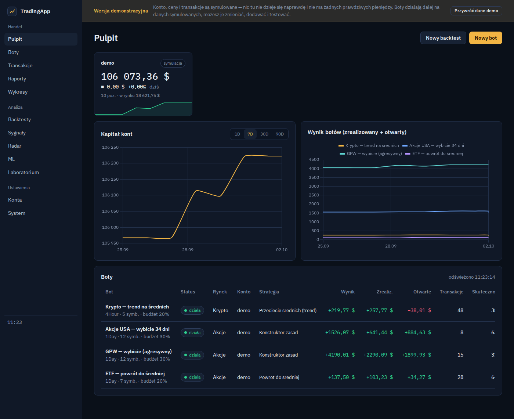
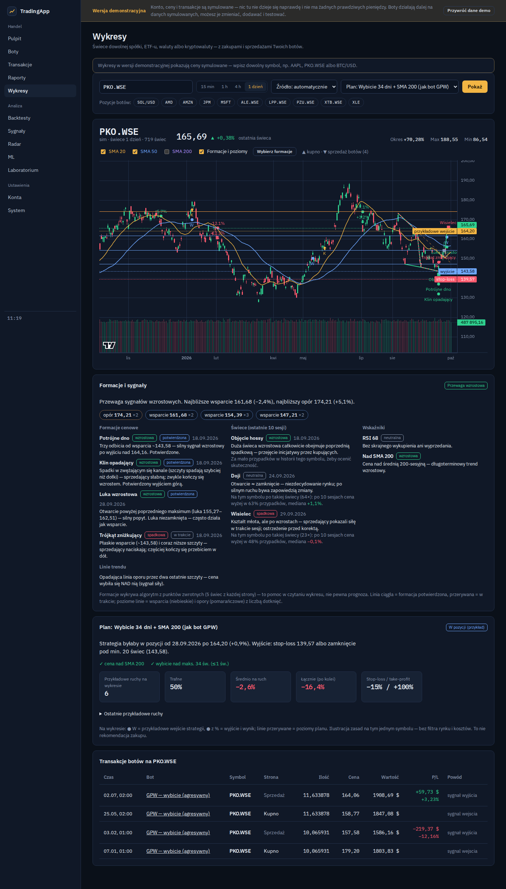

# TradingApp — wersja demonstracyjna

Panel do automatycznych botów inwestycyjnych (akcje USA i GPW, ETF-y, kryptowaluty). W tej wersji wszystko działa na koncie **symulowanym** ze 100 000 USD. Nie ma tu prawdziwych pieniędzy, kont maklerskich ani kluczy, a program nie potrzebuje internetu.

## Jak uruchomić (Windows 10 / 11)

1. Pobierz **[TradingApp-Demo.zip](https://github.com/xboff57/tradingapp-demo/releases/latest/download/TradingApp-Demo.zip)** (ok. 100 MB; wszystkie wersje są w zakładce [Releases](https://github.com/xboff57/tradingapp-demo/releases)).
2. Rozpakuj cały plik do zwykłego folderu, np. `Dokumenty\TradingApp-Demo`. Nie uruchamiaj programu z wnętrza ZIP-a.
3. Kliknij dwa razy **`Uruchom TradingApp Demo.bat`**.
   Jeśli Windows pokaże okno „System Windows ochronił Twój komputer”, kliknij **„Więcej informacji” → „Uruchom mimo to”**. Program nie jest podpisany płatnym certyfikatem.
4. Przeglądarka sama otworzy panel pod adresem http://127.0.0.1:8765. Za pierwszym razem przygotowanie przykładowych danych trwa 1–3 minuty.
5. Aby wyłączyć program, zamknij czarne okno. Aby go usunąć, skasuj folder — nic nie jest instalowane w systemie.

Nie trzeba niczego instalować: Python i biblioteki są w paczce.

## Co można zobaczyć

- **Pulpit:**
  - kapitał konta,
  - wyniki botów,
  - otwarte pozycje.
- **Boty:** 5 przykładowych botów (krypto, akcje USA, GPW, ETF-y), które dalej działają na żywo na danych symulowanych. Możesz je zmieniać i dodawać własne.
- **Transakcje i raporty:**
  - historia transakcji z ostatnich miesięcy,
  - skuteczność,
  - wykresy kapitału.
- **Wykresy:**
  - świece dowolnego symbolu z transakcjami botów,
  - plan strategii ze stop-lossem,
  - formacje cenowe i świecowe, które można włączać i wyłączać.
- **Backtesty:** sprawdzanie strategii na historii, z raportem i propozycjami poprawek.
- **Radar:** ranking najmocniejszych kryptowalut oraz spółek z GPW i USA.
- **ML i Laboratorium:** uczenie maszynowe i porównywanie wariantów strategii.

**System → Przywróć dane demo** wraca do stanu początkowego.

## Ograniczenia wersji demo

- Ceny są **generowane przez program**. Nazwy spółek i kryptowalut (AAPL, PKO.WSE, BTC/USD…) to tylko etykiety, a nie prawdziwe notowania. Wyniki botów nie mówią nic o prawdziwym rynku.
- Wyłączone:
  - podłączanie prawdziwych kont i kluczy API,
  - bramka Interactive Brokers,
  - powiadomienia na telefon,
  - logowanie,
  - aktualizacje.
- Panel jest dostępny **tylko na tym komputerze** (127.0.0.1). Nikt inny w sieci go nie zobaczy.

To pokaz możliwości programu, a nie porada inwestycyjna.

## Dla zaawansowanych

Paczkę buduje i sprawdza automatycznie GitHub Actions (`.github/workflows/paczka-demo.yml`): przenośny Python 3.12, biblioteki z `requirements.txt` i próbne uruchomienie przez plik `.bat`. Bez paczki: `pip install -r requirements.txt`, a potem `DEMO=1 python -m app.main`.

Biblioteki zewnętrzne i ich licencje: [THIRD_PARTY_NOTICES.md](THIRD_PARTY_NOTICES.md).
